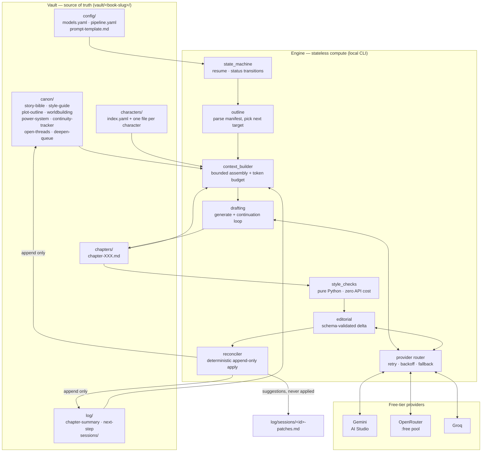

# Architecture

> Scope of this document: the system as it exists in v1 (ADR-0001), plus a
> sketch of deferred phases so the code does not paint itself into a corner.
> Concrete file formats and schemas live in [specs.md](specs.md), not here.

## 1. Core thesis

This is a **stateful-vault, stateless-compute** system.

The novel is not stored in a database and is not stored in an LLM's context
window. It is a directory of plain markdown files. That directory is the
single source of truth. Every model call is a stateless worker that reads a
bounded slice of the vault and returns a bounded change to it.

Two properties follow from that and everything else in this document is
downstream of them:

1. **The vault survives the tooling.** If every script in this repo were
   deleted, the novel would still be there, readable, editable in Obsidian,
   and complete. The engine is an accelerator, not a container.
2. **No model is ever trusted to hold state.** Models draft prose and
   propose structured deltas. Python decides what actually gets written.

## 2. Topology



## 3. The authority model

This is the most important table in the document. It answers: *who is
allowed to write what?*

| Artifact | Written by | Mode | Rationale |
|---|---|---|---|
| `chapters/chapter-XXX.md` | Engine | Create once, then author-owned | Generated prose; the author edits freely afterwards |
| `canon/continuity-tracker.md` | Engine | **Append only** | Locked facts must never be summarised away |
| `canon/open-threads.md` | Engine | **Append + status flip** | A thread may be marked resolved, never deleted |
| `canon/deepen-queue.md` | Engine | **Append only** | Queue of gaps for the author to answer later |
| `log/chapter-summary.md` | Engine | **Append only** | Chronological ledger |
| `log/next-step.md` | Engine | Overwrite | Pure operational pointer, no history value |
| `log/sessions/*.json` | Engine | Create once, immutable | Audit record of what actually happened |
| `canon/plot-outline.md` | **Author only** | Engine may suggest, never write | High-stakes structural artifact |
| `characters/*.md` | **Author only** | Engine may suggest, never write | High-stakes; voice depends on these |
| `canon/story-bible.md` | **Author only** | Never touched by engine | Premise and themes are not the model's business |
| `canon/style-guide.md` | **Author only** | Engine may suggest | See §7, the feedback loop |
| `config/*` | **Author only** | Never touched by engine | — |

Two rules generalise the whole table:

- **The engine never overwrites a file that contains author-written prose.**
- **Every engine write to canon is an append of a new line, computed in
  Python from a validated delta — never a model-emitted file body.**

The second rule exists because of the single most likely way this project
fails. If the editorial model is asked to "return the updated
continuity-tracker.md", it will, over successive sessions, quietly summarise,
compress, or drop older locked facts. Thirty chapters in, early canon has
evaporated — which is precisely the failure the tracker exists to prevent.
The model therefore emits a **delta**, and Python appends.

## 4. One session, end to end

`write-session --book <slug>` executes one chapter (ADR-0003).

```
 1. LOAD        config/models.yaml + config/pipeline.yaml, validate with
                Pydantic. Fail fast on a missing key or unknown provider —
                before spending any API call.

 2. RESUME      Read log/next-step.md. If a prior session is mid-flight,
                resume at its recorded phase or refuse with an explicit
                reason. Never silently regenerate an existing chapter.

 3. TARGET      Parse the chapter manifest in canon/plot-outline.md.
                Determine chapter number, POV key, and beat. Look up the
                POV's assigned model in models.yaml.

 4. ASSEMBLE    Build a bounded context (see §5). Under DRY_RUN, print it
                and stop here — zero API cost.

 5. DRAFT       Call the assigned model. On an eligible failure, walk the
                fallback chain. Never switch model mid-chapter.

 6. EXTEND      If the draft is short of target, run a continuation loop
                passing the tail of the draft, until within tolerance or a
                loop cap is hit.

 7. PERSIST     Write chapters/chapter-XXX.md with provenance frontmatter
                recording which model actually served it. Status: drafted.

 8. INSPECT     Run deterministic style checks in pure Python. Zero API
                cost. Results feed the session report and are handed to the
                editorial pass as evidence rather than re-derived by an LLM.

 9. EDITORIAL   Send chapter + continuity tracker + style guide + the beat
                it was supposed to hit + the POV's character sheet to the
                editor model. Require a strict JSON delta. Validate with
                Pydantic. On invalid output: repair-and-retry, then FAIL
                CLOSED — leave the chapter at status editorial-pending and
                apply nothing.

10. RECONCILE   Apply the validated delta deterministically: append new
                locked facts, append the summary paragraph, flip thread
                statuses, append deepen-queue gaps. Write suggested patches
                for plot-outline and character sheets to a session file —
                never to the targets themselves, and never to stdout.

11. REPORT      Write log/sessions/<session-id>.json. Print a human summary.
                Set chapter status to pending-review. Update next-step.md.
```

Step 9's fail-closed behaviour matters more than it looks. A half-applied
delta is worse than no delta: it corrupts canon while reporting success.

## 5. Context assembly — what the model actually sees

The context budget is the second-most consequential design surface after the
authority model, because it determines whether chapter 40 reads like it
belongs in the same book as chapter 39.

Assembled per chapter, in priority order:

| Slice | Source | Bound |
|---|---|---|
| Style guide | `canon/style-guide.md` | Whole file (kept short by design) |
| POV character sheet | `characters/<pov>.md` | Whole file |
| This chapter's beat | Manifest row + beat prose | One beat only |
| **Verbatim tail of the previous chapter** | `chapters/chapter-(N-1).md` | Final ~500 words |
| Recent summaries | `log/chapter-summary.md` | Last ~2 entries |
| Relevant locked facts | `canon/continuity-tracker.md` | **Retrieved, not dumped** — see below |
| Open threads | `canon/open-threads.md` | Unresolved only |
| Story bible | `canon/story-bible.md` | Premise/tone header only |

Two entries in that table are deliberate departures from `prompt.md`.

**The verbatim tail.** `prompt.md` injects only chapter summaries. A summary
preserves *what happened* and destroys *how it read*. A model handed a
synopsis of chapter 19 writes chapter 20 as though it had read a synopsis —
episodic, tonally reset, no momentum across the seam. Injecting the previous
chapter's actual closing prose costs a few hundred tokens and is the single
highest-leverage lever on perceived continuity.

**Retrieved facts, not dumped facts.** An append-only continuity tracker
grows without bound; by chapter 60 it may hold several hundred locked facts.
Injecting all of them contradicts the "tight, current context" principle the
whole design rests on. Facts are therefore tagged by category and entity at
write time, and only facts touching the POV and the entities named in the
upcoming beat are injected. Compaction of the tracker, when it becomes
necessary, is a **manual author ritual** — never an automated model pass,
because that reintroduces exactly the silent-degradation failure §3 exists
to prevent.

## 6. Provider layer

Six provider modules, one interface (gemini, openrouter, groq, mistral,
nvidia, aihubmix — built and live-verified in Phase 2; cohere/z.ai/
cerebras/github-models/chutes/siliconflow/nanogpt/fireworks/portkey were
evaluated and dismissed, see OQ-02, decisions.md #11-12; requesty has no
valid key yet). Five of the six share an OpenAI-compatible wire format and
one parameterised class serves them all. The router normalises every
response into one of five outcomes:

| Outcome | Fallback eligible? |
|---|---|
| Success | — |
| Rate limited (429, quota) | **Yes** |
| Transient failure (5xx, timeout, connection reset) | **Yes** |
| Model unavailable (unknown slug, deprecated, 404) | **Yes** |
| Permanent failure (bad request, auth, malformed prompt, invalid schema) | **No** |

The last row is a correctness requirement, not an optimisation. A malformed
prompt or an invalid editorial response must not trigger a different model
as if it were a rate limit — that turns a bug into a silent, expensive,
non-deterministic retry storm across providers. In the shipped router the
policy is sharper still: only RateLimited retries the *same* route (it
carries `Retry-After`); transient failures and pulled slugs move down the
chain at once; permanent failure aborts the entire chain.

**Stability principle (decisions.md #8).** Every route needs a fallback on
a different provider, ideally the same model served twice — minimax-m3 runs
on both OpenRouter and NVIDIA NIM, so a `:free` slug pull degrades quality
instead of ending the session.

Three provider-specific realities the layer must absorb:

- **Gemini is not OpenAI-shaped.** OpenRouter, Groq, Mistral, and NVIDIA NIM
  speak an OpenAI-compatible schema; Gemini's native API does not, and system-prompt
  handling differs. The adapter absorbs this; nothing above it knows.
- **Structured-output support is uneven.** Most OpenRouter `:free` models do
  not reliably honour a JSON schema. This matters precisely when the
  editorial pass falls back off its primary model. Hence the repair-retry
  plus fail-closed policy in step 9.
- **`:free` slugs are unstable identifiers.** They get renamed,
  rate-limited to uselessness, or pulled without notice. Model IDs are
  therefore configuration data validated at startup, never constants in
  code, and the model that *actually* served a chapter is recorded in that
  chapter's frontmatter.

## 7. Quality loops

Continuity is checked. Craft is not — unless we build for it. Two loops
exist for that.

**Deterministic style checks (Phase 4 — built).** Asking an LLM "does this
violate the style guide?" produces agreeable mush. These signals are
computable in Python at zero API cost and are far sharper: banned-phrase and
banned-pattern hits, sentence-length distribution, adverb rate, type-token
ratio, dialogue-to-narration ratio, paragraph-length distribution, and
repeated sentence openings. The LLM editorial pass is then reserved for the
one job where it genuinely has an edge — detecting contradiction against
locked facts. This also conserves the tightest-rationed quota in the stack.

**What these checks cannot see, measured 2026-08-31.** Five drafts of the
same chapter were measured and then read. The metrics ranked a
threshold-passing draft first; reading ranked it third. They caught none of
the three real defects: prose that referred to "Chapter 1" out loud, a POV
character described from outside his own head, and a chapter contradicting
canon within twelve paragraphs. The metrics measure AI-prose *tells*, not
quality — which is why specs §14 keeps them advisory, and why promoting
them to a gate would be a mistake dressed as rigour. Contradiction is the
editorial pass's job (§6); voice is the author's.

**The author-edit feedback loop (Phase 6+).** When the author edits a
generated chapter, that diff is the highest-quality voice signal the system
will ever have — a direct demonstration of "wrong" versus "right" in the
author's own hand. Today that signal is discarded. The loop captures it:
diff the author's edited chapter against the generated original, and surface
notable corrections as *suggested* additions to the style guide, for the
author to accept. Suggested, never applied — the style guide is
author-owned per §3.

## 8. Module layout

```text
src/novel_engine/
  __init__.py
  cli/
    write_session.py     # single-chapter session: dry-run, force gate, audit JSON
    new_book.py          # scaffolds a blank vault/<slug>/ and exits
    check_style.py       # check-style: measures one chapter, no API keys needed
  core/
    config.py            # Pydantic settings; models.yaml + pipeline.yaml + startup validation
    vault.py             # THE ONLY WRITER: scaffold_book, write_chapter,
                         #   flip_manifest_status, generated_hash
    outline.py           # manifest parsing; next_target(), resolve_target()
    context_builder.py   # fact parsing/retrieval by entity; verbatim tail;
                         #   template slot filling in file order
    errors.py            # NovelEngineError, ConfigError, ContextError, VaultError
    state_machine.py     # STUB — Phase 6
  providers/
    base.py              # abstract provider; five normalised outcome types
    openai_compat.py     # shared OpenAI-shaped client (openrouter/groq/mistral/
                         #   nvidia/aihubmix/local); api_key=None sends no auth
    gemini.py            # generateContent adapter
    openrouter.py groq.py mistral.py nvidia.py aihubmix.py   # base URLs + build()
    local.py             # llama.cpp on localhost, keyless, context-clamped (ADR-0006)
    router.py            # fallback chain; rate-limit-only in-place retries; jitter
    audit.py             # CallRecord / CallRecorder / allowlist logging
  drafting/
    generate.py          # draft_chapter(): continuation loop, ADR-0005 failed-stub
    provenance.py        # make_session_id, chapter_frontmatter, utc_timestamp
  quality/
    metrics.py           # specs §14 metrics as pure functions; no IO, no verdicts
    style_checks.py      # THRESHOLDS parsing, judge(), build_report()
  editorial/
    schema.py            # STUB — Phase 5 delta models
    pass_runner.py       # STUB — Phase 5 prompt/call/validate/fail-closed
    reconciler.py        # STUB — Phase 5 append-only application
templates/book/          # packaged scaffolder source (vault templates)
vault/
  example-book/          # committed fixture (ADR-0004); chapters 001-004 on disk,
                         #   001-002 hand-written fixtures, 003-004 generated live
tests/                   # fakes.py holds the scripted Provider doubles
```

Layout rationale: `providers/` knows nothing about novels, `quality/` and
`editorial/` know nothing about HTTP, and `vault.py` is the only module that
writes to disk. That last constraint is what makes the authority model in §3
enforceable rather than aspirational.

## 9. Deferred phases

Not built in v1 (ADR-0001). Sketched only so v1 does not preclude them.

- **Phase 7 — GitHub Actions.** Generation runs in the Actions runner, not
  a Vercel function; Hobby-plan functions time out around 60s and generation
  will exceed that. A concurrency gate must refuse to generate while an
  unreviewed session is outstanding, or the review queue silently stacks.
- **Phase 8 — Approval gate.** A GitHub Issue is a fine *notification*
  surface but must not be the source of truth. Approval binds to a specific
  commit and chapter content hash; otherwise a draft edited after approval
  publishes as though it had been reviewed.
- **Phase 9 — Cousins publish endpoint.** Deliberately dumb: bearer auth
  with constant-time compare, schema validation, request size limit,
  idempotent upsert on `(book_slug, chapter_number)`, and a defined conflict
  policy for republishing. No AI logic on that side of the wire, ever.

## 10. What this architecture does not solve

Stated plainly so it is not mistaken for a solved problem.

This design makes state transitions safe, deltas auditable, continuity
recoverable, and provenance traceable. **It does not make the prose good.**
Prose quality is a function of the story bible, the style guide, the beat
sheet, and the base model — none of which are engineering problems. The
architecture is a well-built machine around a generator whose output quality
is currently untested. That test is the author's, and it comes first.
